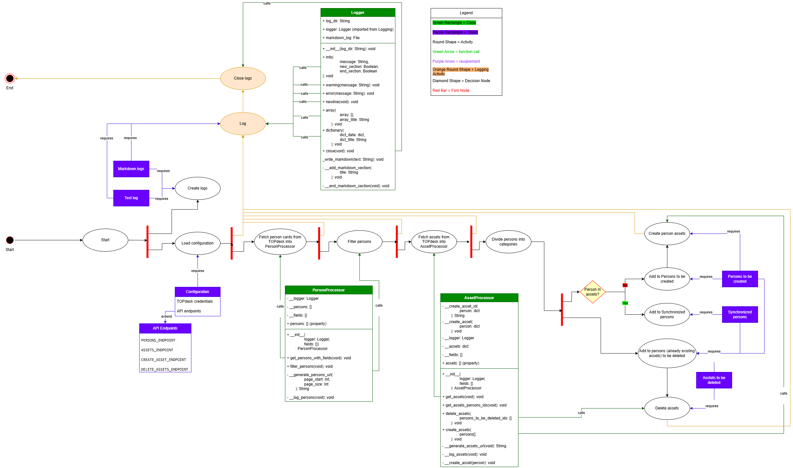

# TOPdesk Person Cards to Assets Import

## Overview
This project synchronizes person cards from TOPdesk with corresponding person assets. It retrieves person records from the TOPdesk API, processes them, determines necessary actions (create or delete), and logs all operations.

## Features
- Fetch & Filter Persons: Retrieves and filters person records from TOPdesk.
- Manage Assets: Fetches, creates, and deletes person-related assets in TOPdesk.
- Logging: Supports structured logs in .log and .md formats with collapsible Markdown sections.
- Configuration Management: Reads API credentials and endpoints from environment variables.

## Architecture
### Components
- TOPdesk API: External system providing person and asset data.
- Logger: Logs messages to .log and .md files.
- PersonProcessor: Handles person record retrieval and filtering.
- AssetProcessor: Manages asset retrieval, creation, and deletion.
- TOPdesk Configuration Module: Loads API credentials and constructs endpoints.
- Utility Functions:
  - categorize_status(): Handles HTTP response categorization and logging.
  - lists_union(): Computes the union of two lists without duplicates.
  - lists_difference(): Computes the difference between two lists.

### Workflow


1. Load Configuration: Read credentials from .env and construct API endpoints.
2. Fetch Data: Retrieve persons and filter them. 
3. Fetch Data: Retrieve assets from TOPdesk. 
4. Determine Sync Status:
   1. Identify synchronized persons. 
   2. Identify persons to be created.
   3. Identify & Delete Outdated Assets:
5. Delete outdated assets.
6. Create Missing Assets: Create new assets for unsynchronized persons.
7. Finalize Process: Log completion and close logger.

## Installation
1. Clone the repository:

    ```git clone https://github.com/your-repo/topdesk-sync.git```
2. Navigate to the project directory:

    ```cd topdesk-sync```
3. Install dependencies
4. Create a .env file and add the following:

    ```
    USERNAME=your_topdesk_username
    PASSWORD=your_topdesk_password
    ```

## Usage
Run the main synchronization script:
```python main.py```

## Logging
Logs are stored in a timestamped directory under logs/, containing:
- Standard Log (.log): Structured log output.
- Markdown Log (.md): Readable log with collapsible sections.

## API Endpoints
| Endpoint               | Description             |
|------------------------|-------------------------|
| PERSONS_ENDPOINT       | Fetch person records    |
| ASSETS_ENDPOINT        | Retrieve assets         |
| CREATE_ASSET_ENDPOINT  | Create new assets       |
| DELETE_ASSETS_ENDPOINT | Delete outdated assets  |

## License
This project is licensed under the MIT License.